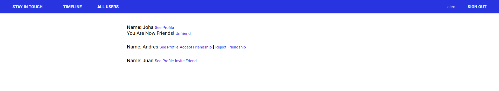

# Scaffold for social media app with Ruby on Rails

> This repo includes intial code for social media app with basic styling. Its purpose is to be a starting point for Microverse students.

In this project contains a social media app with ruby on rails using the MVC process.
In this specific branch I create the friendship model that connects between users.

## Built With

- Ruby v2.7.0
- Ruby on Rails v5.2.4.1

### Prerequisites

Ruby: 2.7.0
Rails: 5.2.4.4
PostgreSQL: >=12.5

## Setup

### Installation

Get a local copy on the project

`git clone https://github.com/alejandrotoledoweb/ror-social-scaffold.git`

cd on the folder created
run the following commands to install the depedencies
`bundle install`
then create and migrate the tables for the databases
`rails db:create`
`rails db:migrate`
`rails db:seed`

Run these command to test the models and associations

run this command to start the server
`rails server`
and then go to this address http://localhost:3000 to have access.

then you can sign up with your info and create posts, comments, like other posts, send friend request to other people.

### Test models

Run these command to test the models and associations

`rspec spec/models/friendship_spec.rb`
`rspec spec/models/user_spec.rb`

> Tests will be added by Microverse students. There are no tests for initial features in order to make sure that students write all tests from scratch.

### Deployment

You can check the entire project live version in this [link]()

## Authors

👤 **Alejandro Toledo**

- GitHub: [@alejandrotoledoweb](https://github.com/alejandrotoledoweb)
- Twitter: [@alejot](https://twitter.com/alejot) 
- LinkedIn: [Alejandro Toledo](https://www.linkedin.com/in/alejandro-toledo-3b444b109/) 

## 🤝 Contributing

Contributions, issues and feature requests are welcome!

Feel free to check the [issues page](issues/).

## Show your support

Give a ⭐️ if you like this project!

## Acknowledgments

- Project originally taken from The Odin Project
- Project inspired by Microverse Program

## 📝 License

TBA

